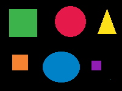

# Rotulação de Componentes Conectadas

Trabalho de Processamento de Imagens — UFT, Ciência da Computação, 2026.2
Professora: Glenda Botelho
Heitor Fernandes e Maurício Monteiro

Implementação do algoritmo de rotulação (*labelling*) em imagens binárias. O programa
encontra os objetos separados de uma imagem e dá um número diferente para cada um.



## O que precisa

Python 3, numpy e Pillow.

```
pip install numpy pillow
```

## Como rodar

```
python3 main.py imagem.png       rotula a imagem e salva o resultado
python3 main.py imagem.png --8   usa vizinhança de 8 em vez de 4
python3 main.py --testes         roda os exemplos da aula
```

O programa salva duas imagens: `binaria.png`, que é a imagem depois da binarização, e
`rotulada.png`, com cada objeto pintado de uma cor.

Saída do exemplo:

```
imagem: teste.png
conectividade: 4
objetos encontrados: 7

objeto  area
     1  2025
     2  2116
     3   651
     4  2439
     5   676
     6   256
     7     1
```

## Como funciona

Primeiro a imagem é binarizada: pixel abaixo de 127 vira 0, o resto vira 255.

Depois vem a primeira varredura, da esquerda para a direita e de cima para baixo. Para cada
pixel do objeto, o programa olha os vizinhos que já foram visitados, que na vizinhança de 4
são o da esquerda e o de cima:

- se nenhum dos dois tem rótulo, o pixel ganha um rótulo novo
- se só um tem, o pixel herda esse rótulo
- se os dois têm o mesmo rótulo, o pixel recebe esse rótulo
- se os dois têm rótulos diferentes, o pixel recebe o menor e os dois rótulos são marcados
  como sendo do mesmo objeto

Na segunda varredura, cada rótulo é trocado pelo representante do seu grupo e a numeração
é refeita de 1 em diante.

Para usar vizinhança de 8 basta olhar também as duas diagonais de cima, que já foram
visitadas. O resto do algoritmo é igual.

## Arquivos

- `rotulacao.py` — binarização e o algoritmo
- `main.py` — programa principal e os testes
- `teste.png` — imagem de teste com 7 objetos

## Testes

O comando `python3 main.py --testes` roda o exemplo resolvido em aula e o exercício da
matriz 6×6, nas duas conectividades. No primeiro caso a matriz de rótulos é comparada com a
resposta da aula.
